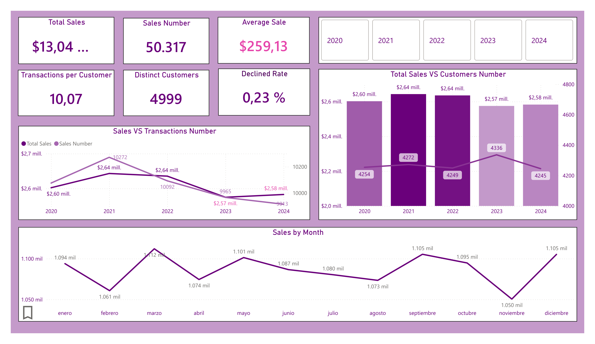
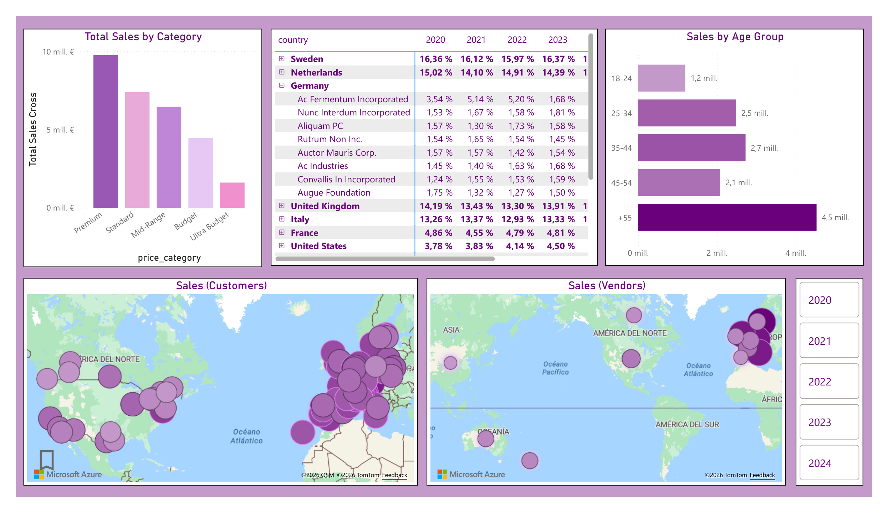
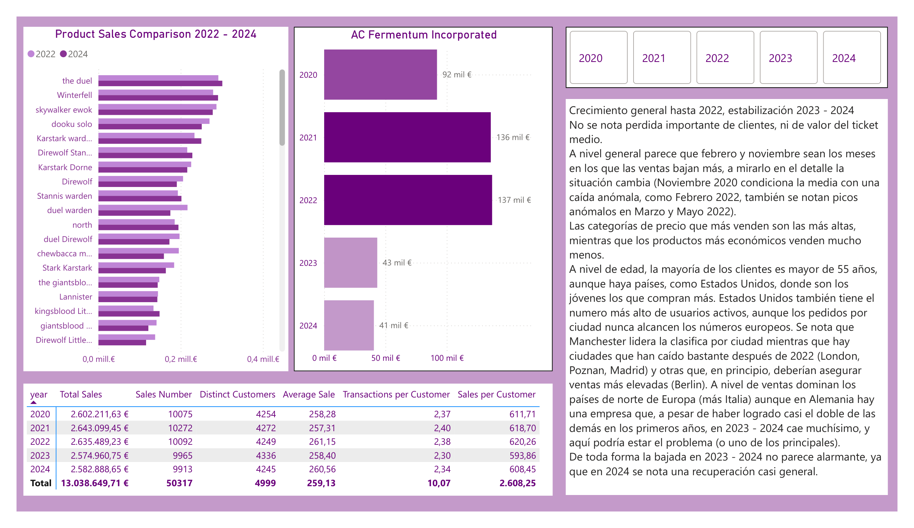

# Power BI Sales Analysis

Academic Power BI project developed as part of the Data Analytics program at IT Academy – Barcelona Activa.

The exercise analyzes five years of e-commerce sales data, with a particular focus on understanding the slight decline observed in 2023–2024.

## Analysis

The dashboard explores:

- Sales evolution and seasonality
- Transactions, customers and average ticket
- Customer segmentation by age and geography
- Sales performance by product and company
- Possible factors behind the 2023–2024 sales decline

## Key Findings

Sales grew until 2022 and then stabilized in 2023–2024. The analysis does not indicate a major structural decline: average transaction value and the customer base remained relatively stable, while transaction frequency showed moderate variation.

The analysis also identified recurring seasonal patterns, differences across geographic markets and specific companies and products with notable changes in performance.

## Dashboard

### Sales Overview

### Customer & Market Analysis

### Sales Decline Analysis

## Tools

Power BI · Power Query · DAX · Data Modeling · Data Visualization

## Dataset

The dataset was provided as educational material by IT Academy and is not redistributed in this repository.

The Power BI report is available in:

`sprint-08-sales-analysis.pbix`

---

## Versión en castellano

Proyecto académico de Power BI desarrollado como parte del programa de Data Analytics de IT Academy – Barcelona Activa.

El ejercicio analiza cinco años de ventas de una empresa de e-commerce, con especial atención a la ligera bajada observada en 2023–2024.

El dashboard analiza la evolución y estacionalidad de las ventas, transacciones, clientes, ticket medio, segmentación geográfica y por edad, productos y empresas.

### Principales conclusiones

Las ventas crecieron hasta 2022 y posteriormente se estabilizaron. El análisis no muestra una caída estructural importante: el ticket medio y la base de clientes se mantienen relativamente estables, mientras que la frecuencia de compra presenta variaciones moderadas.

También se identifican patrones estacionales recurrentes y diferencias de comportamiento entre mercados, productos y empresas.

### Herramientas

Power BI · Power Query · DAX · Modelado de datos · Visualización

Los datos utilizados fueron proporcionados como material académico por IT Academy y no se redistribuyen en este repositorio.